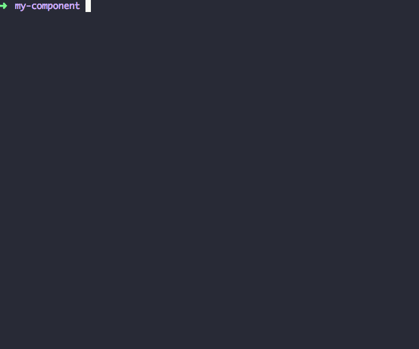
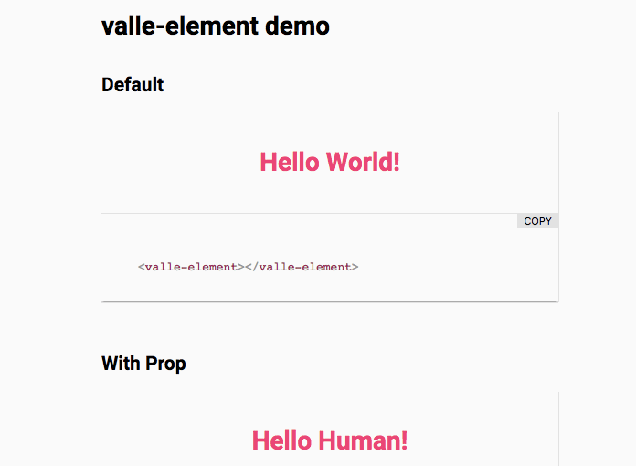

# valle-element generator

> Generator for valle elements using Polymer 2x.

[![NPM version][npm-image]][npm-url]
[![Build Status][travis-image]][travis-url]
[![Dependency Status][daviddm-image]][daviddm-url]

## Table of contents

- [How to install and use](#how-to-install-and-use)
- [The generated element](#the-generated-element)
  - [Stack / Features](#stack-/-features)
  - [Folders Structure](#folders-structure)
- [Development](#development)
  - [Run the project locally](#run-the-project-locally)
  - [Code Style](#code-style)
  - [Tests](#tests)
- [Versioning](#versioning)
- [Contributing](#contributing)
- [History](#history)
- [License](#license)

## How to install and use

Verify if you have [node](http://nodejs.org/) and [npm](https://www.npmjs.org/) installed.

1 - Install [bower](https://bower.io/) and [Polymer CLI](https://www.polymer-project.org/2.0/docs/tools/polymer-cli):

```sh
$ npm install -g bower
$ npm install -g polymer-cli
```

2 - Install the valle-element generator:

```sh
$ npm install -g generator-polymer-init-valle-element
```

3 - Then generate your new element:

```sh
$ polymer init
```



## The generated element

#### Stack / Features:

- Polymer **2.x**
- **Bower** for dependencies
- Unit tests with Web **Component Tester**
- Lint with **ESlint** and **Polylint**
- CI with **travis**
- Provide **UI docs**
- **Docs** for all
- Styling API with **custom properties**
- more...

#### Folders Structure:

	.
	├── README.md
	├── CONTRIBUTING.md
	├── LICENSE.md
	├── demo/
	|   └── index.html
	├── test/
	|   ├── you-element_test.html
	|   └── index.html
	├── .editorconfig
	├── .eslintrc.json
	├── .gitignore
	├── .travis.yml
	├── wct.conf.json
	├── bower.json
	├── polymer.json
	├── you-element.html
	└── index.html

#### UI Docs:

Provide by [iron-demo-helpers](https://github.com/PolymerElements/iron-demo-helpers).



## Development

#### Run the project locally

1 - Prepare the environment:

```sh
$ npm install -g polymer-cli
```

2 - Clone the project and install the dependencies:

```sh
$ git clone https://github.com/valleweb/generator-polymer-init-valle-element.git
$ cd generator-polymer-init-valle-element
$ npm install
```

3 - Link the generator locally:

```sh
$ npm link
```

4 - Run the generator:

```sh
$ polymer init
```

#### Code Style

Follow the [Banana NodeJS style guide](https://github.com/bananacss/banana-style-guide).

#### Tests

*Run the unit tests with [mocha](https://mochajs.org/) and Validate the code style with [ESLint](http://eslint.org/):*

```sh
$ npm test
```

## Versioning

To keep better organization of releases we follow the [Semantic Versioning 2.0.0](http://semver.org/) guidelines.

## Contributing

Find on our [issues](https://github.com/valleweb/generator-polymer-init-valle-element/issues/) the next steps of the project ;)
<br>
Want to contribute? [Follow these recommendations](https://github.com/valleweb/generator-polymer-init-valle-element/blob/master/CONTRIBUTING.md).

## History

See [Releases](https://github.com/valleweb/generator-polymer-init-valle-element/releases) for detailed changelog.

## License

[MIT License](https://github.com/valleweb/generator-polymer-init-valle-element/blob/master/LICENSE.md) © [valleweb team](https://github.com/valleweb)

[npm-image]: https://badge.fury.io/js/generator-polymer-init-valle-element.svg
[npm-url]: https://npmjs.org/package/generator-polymer-init-valle-element
[travis-image]: https://travis-ci.org/valleweb/generator-polymer-init-valle-element.svg?branch=master
[travis-url]: https://travis-ci.org/valleweb/generator-polymer-init-valle-element
[daviddm-image]: https://david-dm.org/valleweb/generator-polymer-init-valle-element.svg?theme=shields.io
[daviddm-url]: https://david-dm.org/valleweb/generator-polymer-init-valle-element
